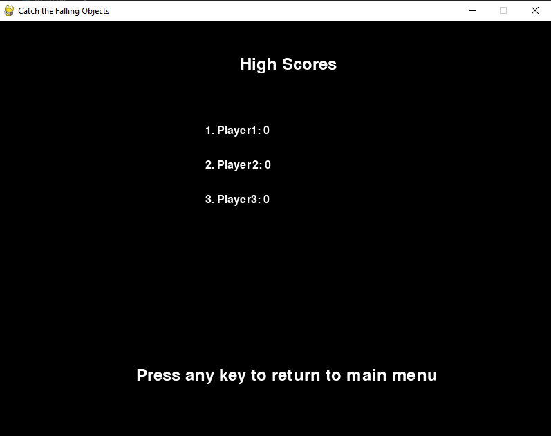

# Catch the Falling Objects


## Description

"Catch the Falling Objects" is a simple arcade game developed using Python and Pygame. The objective of the game is to control a player character at the bottom of the screen and catch falling objects while avoiding misses. As you progress, the game becomes more challenging with increased falling speeds and occasional power-ups.

## Features

- **Player Control**: Use the left and right arrow keys to move the player character.
- **Falling Objects**: Objects of various sizes and speeds fall from the top of the screen.
- **Score and Missed Count**: Keep track of your score and the number of missed objects.
- **Power-Ups**: Occasionally, power-ups appear that can affect gameplay (sound effects implemented).
- **Game Over**: The game ends when the number of missed objects reaches a certain limit.

## Installation

1. **Prerequisites**:
   - Python 3.x installed on your system.
   - Pygame library installed (`pip install pygame`).

2. **Download** or clone the repository:
   ```bash
   git clone https://github.com/your/repository.git
   cd Catch-the-Falling-Objects
   ```

3. **Run the Game**:
   ```bash
   python main.py
   ```

## Controls

- **Left Arrow Key**: Move player left.
- **Right Arrow Key**: Move player right.
- **Esc Key**: Return to main menu (during gameplay).

## Screenshots

<p align="center">
  
   
  
</p>


## Credits

- Developed by **Ghulam Mustafa**

## License

This project is licensed under the MIT License - see the [LICENSE](https://github.com/git/git-scm.com/blob/main/MIT-LICENSE.txt) file for details.

---
